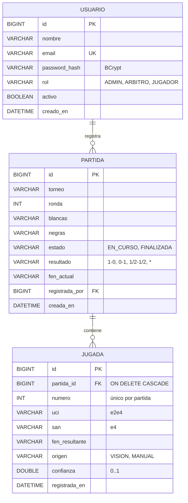

# Diagrama entidad-relación (MySQL)

El esquema lo crea Flyway con `backend/src/main/resources/db/migration/V1__esquema_inicial.sql`.

```mermaid
erDiagram
    USUARIO ||--o{ PARTIDA : registra
    PARTIDA ||--o{ JUGADA : contiene

    USUARIO {
        BIGINT id PK
        VARCHAR nombre
        VARCHAR email UK
        VARCHAR password_hash "BCrypt"
        VARCHAR rol "ADMIN, ARBITRO, JUGADOR"
        BOOLEAN activo
        DATETIME creado_en
    }
    PARTIDA {
        BIGINT id PK
        VARCHAR torneo
        INT ronda
        VARCHAR blancas
        VARCHAR negras
        VARCHAR estado "EN_CURSO, FINALIZADA"
        VARCHAR resultado "1-0, 0-1, 1/2-1/2, *"
        VARCHAR fen_actual
        BIGINT registrada_por FK
        DATETIME creada_en
    }
    JUGADA {
        BIGINT id PK
        BIGINT partida_id FK "ON DELETE CASCADE"
        INT numero "único por partida"
        VARCHAR uci "e2e4"
        VARCHAR san "e4"
        VARCHAR fen_resultante
        VARCHAR origen "VISION, MANUAL"
        DOUBLE confianza "0..1"
        DATETIME registrada_en
    }
```
