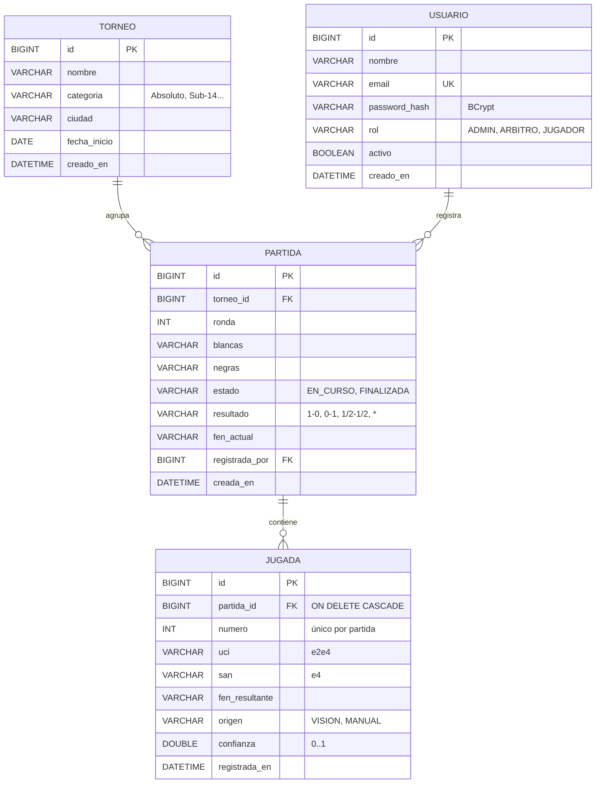

# Diagrama entidad-relación (MySQL)

El esquema lo crea Flyway con `backend/src/main/resources/db/migration/` (V1: esquema inicial; V2: torneos, con migración de los datos existentes).

```mermaid
erDiagram
    TORNEO ||--o{ PARTIDA : agrupa
    USUARIO ||--o{ PARTIDA : registra
    PARTIDA ||--o{ JUGADA : contiene

    USUARIO {
        BIGINT id PK
        VARCHAR nombre
        VARCHAR email UK
        VARCHAR password_hash "BCrypt"
        VARCHAR rol "ADMIN, ARBITRO, JUGADOR"
        BOOLEAN activo
        DATETIME creado_en
    }
    TORNEO {
        BIGINT id PK
        VARCHAR nombre
        VARCHAR categoria "Absoluto, Sub-14..."
        VARCHAR ciudad
        DATE fecha_inicio
        DATETIME creado_en
    }
    PARTIDA {
        BIGINT id PK
        BIGINT torneo_id FK
        INT ronda
        VARCHAR blancas
        VARCHAR negras
        VARCHAR estado "EN_CURSO, FINALIZADA"
        VARCHAR resultado "1-0, 0-1, 1/2-1/2, *"
        VARCHAR fen_actual
        BIGINT registrada_por FK
        DATETIME creada_en
    }
    JUGADA {
        BIGINT id PK
        BIGINT partida_id FK "ON DELETE CASCADE"
        INT numero "único por partida"
        VARCHAR uci "e2e4"
        VARCHAR san "e4"
        VARCHAR fen_resultante
        VARCHAR origen "VISION, MANUAL"
        DOUBLE confianza "0..1"
        DATETIME registrada_en
    }
```
